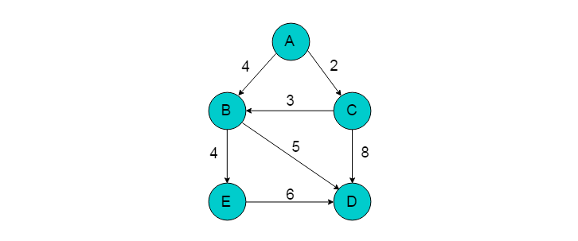
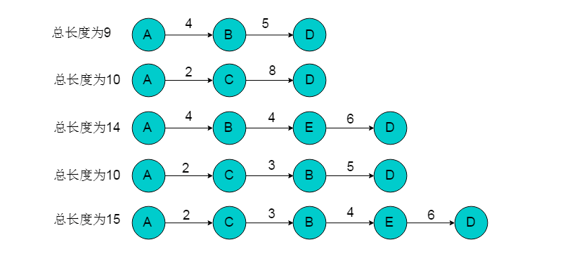
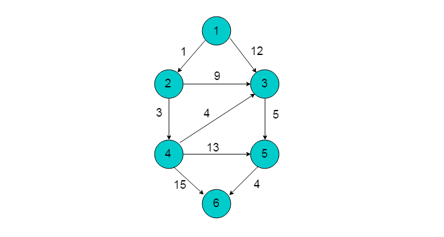
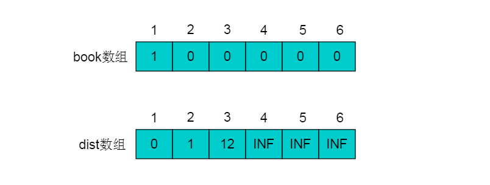
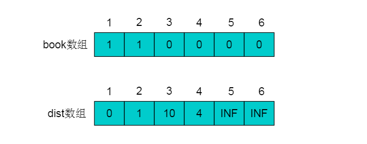
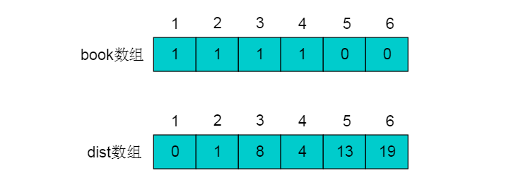
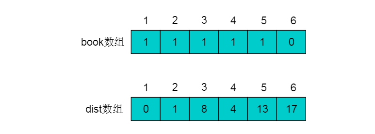
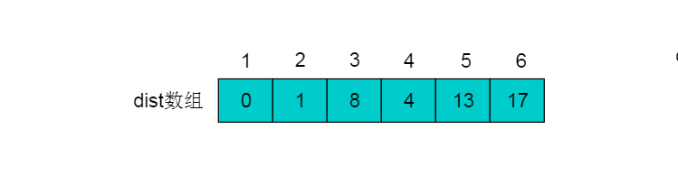

# 图最短路径

 最短路径问题一直是图论研究的热点问题。例如在实际生活中的路径规划、地图导航等领域有重要的应用。
关于求解图的最短路径方法也层出不穷，本篇文章将详细讲解图的最短路径经典算法。

### 重要概念

* 图的路径：图G = <V，E>中，从任一顶点开始，由边或弧的邻接至关系构成的有限长顶点序列称为路径。
* 注意：有向图的路径必须沿弧的方向构成顶点序列；构成路径的顶点可能重复出现(即允许反复绕圈)。
* 路径长度：路径中边或弧的数目。
* 简单路径：除第一个和最后一个顶点外，路径中无其它重复出现的顶点，称为简单路径。
* 回路或环：路径中的第一个顶点和最后一个顶点相同时，称为回路或环。
* 图的最短路径：如果从有向图中某一顶点(称为源点)到达另一顶点(称为终点)的路径可能不止一条，如何找到一条路径使得沿此路径上各边上的权值总和达到最小。

### 深度或广度优先搜索算法

##### 算法概述

从起点开始访问所有深度遍历路径或广度优先路径，则到达终点节点的路径有多条，取其中路径权值最短的一条则为最短路径。

##### 算法流程

1. 选择单源的起点作为遍历的起始点。
2. 采用深度优先搜索或者广度优先搜索的方式遍历图，在遍历同时记录可以到达终点的路径。
3. 在所有路径中选择距离最短的路径。

##### 实例图解

例如：下图所示的有向图中，选取A为源点，D为终点，采用遍历的方式获取最短路径。

1. 选择A为遍历起始点，D为终点。
2. 采用遍历的方式获取A到D路径。通过遍历方式得到的路径共有5条。

3. 从中选择距离最短的路径为A->B->D，长度为9。

##### 算法分析

采用遍历的方式获取单源最短路径，是一种暴力破解的方式。算法的性能与遍历过程性能相关。采用深度优先搜索遍历时时间复杂度为O(n+e)。

### 迪杰斯特拉（Dijkstra）算法

##### 算法概述

Dijkstra（迪杰斯特拉）算法是典型的单源最短路径算法，用于计算某个顶点到其他所有顶点的最短路径。Dijkstra（迪杰斯特拉）算法要求图中不存在负权边，即保证图中每条边的权重值为正。
算法的基本思想是：从源点出发，每次选择离源点最近的一个顶点前进，然后以该顶点为中心进行扩展，最终得到源点到其余所有点的最短路径。

##### 算法流程

1. 将所有的顶点分为两部分：已知最短路程的顶点集合P和未知最短路径的顶点集合Q。最开始，已知最短路径的顶点集合P中只有源点s一个顶点。我们这里用一个book[i]数组来记录哪些点在集合P中。例如对于某个顶点i，如果book[i] = 1则表示这个顶点在集合P中，如果book[i] = 0则表示这个顶点在集合Q中。
2. 设置源点s到自己的最短路径为0即dist = 0。若存在源点有能直接到达的顶点i，则把dist[i]设为e[s][i]。同时把所有其它（即源点不能直接到达的）顶点的最短路径为设为∞。
3. 在Q中选择一个离源点s最近的顶点u（即dist[u]最小）加入到P中。并考察所有以点u为起点的边，对每一条边进行松弛操作。
4. 重复第3步，如果集合Q为空，算法结束。最终dist数组中的值就是源点到所有顶点的最短路径。

##### 实例图解

例如：下图所示的有向图，以顶点1为源点，运用Dijkstra算法，获得最短路径。

1. 初始状态下，集合P中只有顶点1， book[1]=1。book数组以及dist数组如图：

2. 从dist数组中可以看出，距离顶点1最近的顶点为2，不存在可以中转的顶点使得顶点1到顶点2的距离更短，且顶点2不在集合P中。
因此，选择顶点2加入集合P中，令book[2]=1。顶点2加入后，需要考虑经过顶点2进行中转，使得顶点1到达其余顶点的距离发生改变。
顶点2的出边有<2,3>和<2,4>。
则需重新计算dist[3]和dist[4]。dist[3] = dis[2]+e[2][3] = 10 < 12，令dist[3]松弛为10。dist[4] = dis[2]+e[2][4] = 4 < INF，令dist[4]松弛为4。
更新后的book数组和dist数组如下：

3. 从剩余顶点3、4、5、6中选择dist中最近顶点为顶点4（因为顶点2已经在集合P中不能再次选择）。
将顶点4加入集合P中，令book[4]=1。按照相同的方式更新dist数组。顶点4的所有出边<4,3>（dist[3] = dis[4]+e[4][3]），<4,5>（dist[5] = dis[4]+e[4][5]）和<4,6>（dist[6] = dis[4]+e[4][6]）用同样的方法进行松弛。
松弛完毕之后book数组和dist数组为：

4. 继续在剩余的顶点3、顶点5顶点和6中，选出离顶点1最近的顶点。选择3号顶点。
此时，dis[3]的值已对3号顶点的所有出边（3->5）（dist[5] = dis[3]+e[3][5]）进行松弛。松弛完毕之后dist数组为：

5. 继续在剩余的顶点5和顶点6，选出离顶点1最近的顶点，选择5号顶点。对5号顶点的所有出边（5->4）（dist[4] = dis[5]+e[5][4]）进行松弛。
松弛完毕之后dist数组为：

6. 最后选择顶点6加入集合P，令book[6]=1。由于6号顶点没有出边，因此不用进行松弛处理。
最终得到的dist数组如下：

##### 算法分析

###### 复杂度
迪杰斯特拉（Dijkstra）算法适用于权值为非负的图的单源最短路径，
使用最小堆时间复杂度是O(VLogV)，用斐波那契堆的复杂度O(E+VlgV)。

###### 为什么不能有负权边
Dijkstra算法当中将节点分为已求得最短路径的集合（记为P）和未确定最短路径的个集合（记为Q），
归入P集合的节点的最短路径及其长度不再变更，如果边上的权值允许为负值，那么有可能出现当与P内某点（记为a）以负边相连的点（记为b）确定其最短路径时，
它的最短路径长度加上这条负边的权值结果小于a原先确定的最短路径长度(意思是原先从a0---a已经确定一个最短路径，而此时的边权值为负，
则此步骤中的边权计算结果必定小于已经确定了的路径长度)，但是a在Dijkstra算法下是无法更新的，由此便可能得不到正确的结果。

### Bellman-Ford算法

##### 算法概述

Bellman-Ford算法是从Dijkstra算法算法引申出来的，它可以解决带有负权边的最短路径问题。值得注意的是，Dijkstra算法和下面的Floyd算法是基于邻接矩阵的，而Bellman-Ford算法是基于邻接表，从边的角度考量的。
用一句话概括就是：对所有的边进行n-1次松弛操作。如果图中存在最短路径（即不存在负权回路），那么最短路径所包含的边最多为n-1条，也就是不可能包含回路。因为如果存在正回路，该路径就不是最短的，而如果存在负回路，就压根就不存在所谓的最短路径。

##### 算法流程

1. 从源点到任意一点u的最短路径的长度，初始化数组dist[u]为0，其余dist[i]为无穷大。
2. 以下操作循环执行至多n-1次，n为顶点数：对于每一条边edge(u,v)，如果dist[u] + weight(u,v) < dist[v]，则令dist[v] = dist[u] + weight(u,v)。若上述操作没有对dist进行更新，说明最短路径已经查找完毕，或者部分点不可达，跳出循环。否则执行下次循环；
3. 检测图中是否存在负环路，即权值之和小于0的环路。对于每一条边edge(u,v)，如果存在dist[u] + weight(u,v) < dist[v]的边，则图中存在负环路，即是说该图无法求出单源最短路径。否则数组dist[n]中记录的就是源点s到各顶点的最短路径长度。

##### 实例图解

