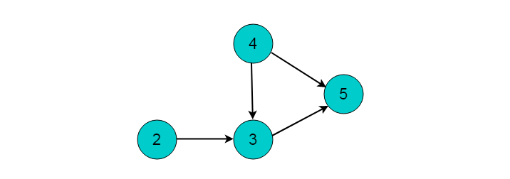

# 图拓扑排序

在工程实践中,一个工程项目往往由若干个子项目组成。这些子项目间往往有两种关系:
1. 先后关系，即必须在某个项完成后才能开始实施另一个子项目。
2. 子项目间无关系，即两个子项目可以同时进行,互不影响。

例如：在工厂里产品的生产线上，一个产品由若干个零部件组成。零部件生产时，也存在这两种关系:
1. 先后关系，即一个部件必须在完成后才能生产另一个部件;
2. 部件间无先后关系，即这两个部件可以同时生产。

那么如何合理的分配资源才能保证工程能够按时完成呢？将任务作为图的顶点，将任务之间的依赖关系作为图的边，这样就可以将实际问题抽象为数据结构图论中的典型问题——图的拓扑排序。

### 重要概念

* 有向无环图（Directed Acyclic Graph, DAG）是有向图的一种，字面意思的理解就是图中没有环。常常被用来表示事件之间的驱动依赖关系，管理任务之间的调度。
* AOV网：在每一个工程中，可以将工程分为若干个子工程，这些子工程称为活动。如果用图中的顶点表示活动，以有向图的弧表示活动之间的优先关系，这样的有向图称为AOV网，即顶点表示活动的网。在AOV网中，如果从顶点vi到顶点j之间存在一条路径，则顶点vi是顶点vj的前驱，顶点vj是顶点vi的后继。活动中的制约关系可以通过AOV网中的表示。 在AOV网中，不允许出现环，如果出现环就表示某个活动是自己的先决条件。因此需要对AOV网判断是否存在环，可以利用有向图的拓扑排序进行判断。
* 拓扑序列：设G=(V,E)是一个具有n个顶点的有向图，V中的顶点序列v1,v2,…,vn,满足若从顶点vi到vj有一条路径，则在顶点序列中顶点vi必在vj之前，则我们称这样的顶点序列为一个拓扑序列。
* 拓扑排序：拓扑排序是对一个有向图构造拓扑序列的过程。

### 拓扑排序

拓扑排序（Topological Sorting）是一个有向无环图（DAG, Directed Acyclic Graph）的所有顶点的线性序列。且该序列必须满足下面两个条件：
1. 每个顶点出现且只出现一次。
2. 若存在一条从顶点 A 到顶点 B 的路径，那么在序列中顶点 A 出现在顶点 B 的前面。

注：有向无环图（DAG）才有拓扑排序，非DAG图没有拓扑排序一说。

### 入度表法

入度表法是根据顶点的入度来判断是否存在依赖关系。若顶点入度不为0。则必然此顶点的事件有前驱依赖事件，因此每次选取入度为0的顶点输出，则符合拓扑排序的性质。

##### 算法流程

1. 从图中选择一个入度为0的顶点，输出该顶点。
2. 从图中删除该节点及其所有出边（即与之邻接的所有顶点入度-1）
3. 反复执行这两个步骤，直至所有节点都输出，即整个拓扑排序完成；或者直至剩下的图中再没有入度为0的节点，这就说明此图中有回路，不可能进行拓扑排序。

##### 实例图解
例如：下图所示的有向无环图，采用入度表的方法获取拓扑排序过程。

1. 选择图中入度为0的顶点1，输出顶点1。删除顶点1，并删除以顶点1为尾的边。删除后图为：

2. 继续选择入度为0的顶点。现在，图中入度为0的顶点有2和4，这里我们选择顶点2，输出顶点2。删除顶点2，并删除以顶点2为尾的边。删除后图为：

3. 选择入度为0的顶点4，输出顶点4.删除顶点4，并删除以顶点4为尾的边。删除后图为：

4. 选择入度为0的顶点3，输出顶点3.删除顶点3，并删除以顶点3为尾的边。删除后图为：

5. 最后剩余顶点5，输出顶点5，拓扑排序过程结束。最终的输出结果为：

##### 性能分析

算法时间复杂度分析：统计所有节点入度的时间复杂性为（VE）；接下来删边花费的时间也是（VE），总花费时间为O（VE）。若使用队列保存入度为0的顶点，则可以将这个算法复杂度将为O（V+E）。

### DFS方法

深度优先搜索过程中，当到达出度为0的顶点时，需要进行回退。在执行回退时记录出度为0的顶点，将其入栈。则最终出栈顺序的逆序即为拓扑排序序列。

##### 算法流程

1. 对图执行深度优先搜索。
2. 在执行深度优先搜索时，若某个顶点不能继续前进，即顶点的出度为0，则将此顶点入栈。
3. 最后得到栈中顺序的逆序即为拓扑排序顺序。

##### 实例图解

例如下图所示的有向无环图，采用DFS的方法获取拓扑排序过程。

1. 选择起点为顶点1,，开始执行深度优先搜索。顺序为1->2->3->5。

2. 深度优先搜索到达顶点5时，顶点5出度为0。将顶点5入栈。

3. 深度优先搜索执行回退，回退至顶点3。此时顶点3的出度为0，将顶点3入栈。

4. 回退至顶点2，顶点2出度为0，顶点2入栈。

5. 回退至顶点1，顶点1可以前进位置为顶点4，顺序为1->4。

6. 顶点4出度为0，顶点4入栈。

7. 回退至顶点1，顶点1出度为0，顶点1入栈。

8. 栈的逆序为1->4->2->3->5。此顺序为拓扑排序结果。

### 性能分析

时间复杂度分析：首先深度优先搜索的时间复杂度为O(V+E)，而每次只需将完成访问的顶点存入数组中，需要O(1)，因而总复杂度为O(V+E)。

