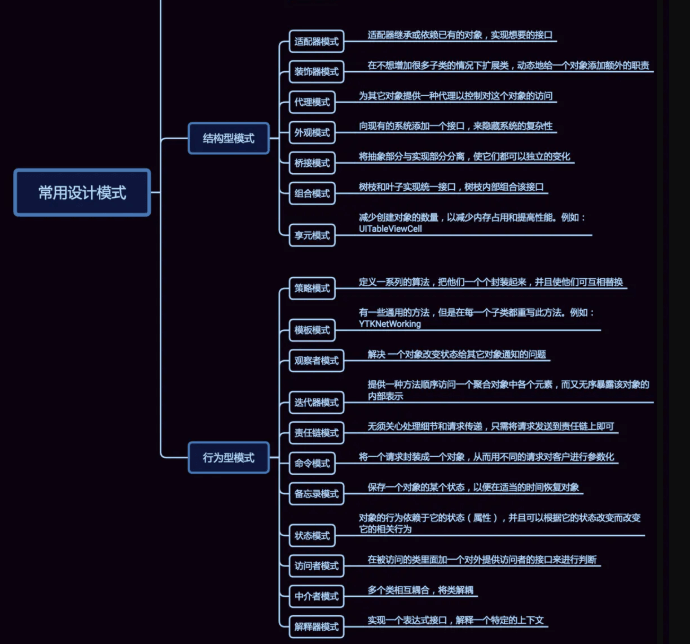

# 设计模式总篇

## 设计模式简介
　　设计模式是一套被反复使用的、多数人知晓的、经过分类编目的、代码设计经验的总结。
使用设计模式是为了重用代码、让代码更容易被他人理解、保证代码可靠性。 
毫无疑问，设计模式于己于他人于系统都是多赢的，
设计模式使代码编制真正工程化，设计模式是软件工程的基石，
如同大厦的一块块砖石一样。
项目中合理地运用设计模式可以完美地解决很多问题，
每种模式在现实中都有相应的原理来与之对应，
每种模式都描述了一个在我们周围不断重复发生的问题，
以及该问题的核心解决方案，这也是设计模式能被广泛应用的原因。

#### 什么是 GOF（四人帮，全拼 Gang of Four）？
　　在 1994 年，由 Erich Gamma、Richard Helm、Ralph Johnson 和 John Vlissides 四人合著出版了一本名为 Design Patterns - Elements of Reusable Object-Oriented Software（中文译名：设计模式 - 可复用的面向对象软件元素） 的书，
该书首次提到了软件开发中设计模式的概念。
四位作者合称 GOF（四人帮，全拼 Gang of Four）。
他们所提出的设计模式主要是基于以下的面向对象设计原则。

* 对接口编程而不是对实现编程。
* 优先使用对象组合而不是继承。

#### 设计模式的类型
总共有 23 种设计模式。这些模式可以分为三大类：创建型模式（Creational Patterns）、结构型模式（Structural Patterns）、行为型模式（Behavioral Patterns）。

* 创建型模式：对象实例化的模式，创建型模式用于解耦对象的实例化过程。
* 结构型模式：把类或对象结合在一起形成一个更大的结构。
* 行为型模式：类和对象如何交互，及划分责任和算法。

