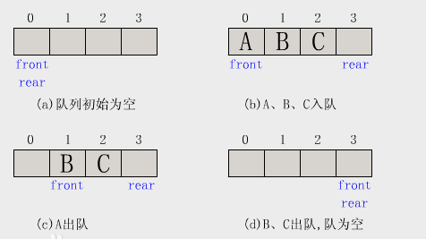
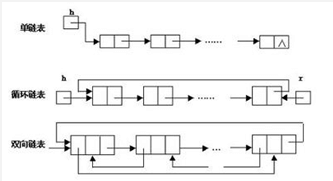
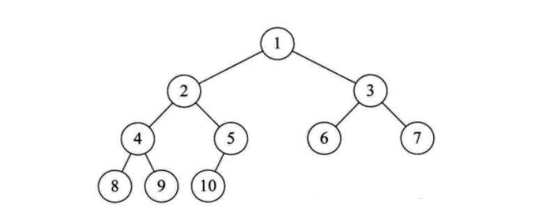
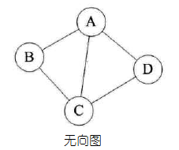
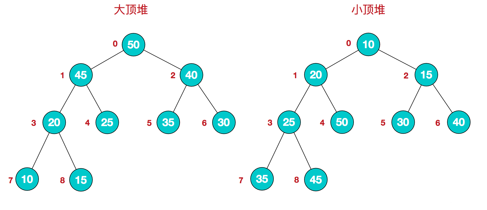
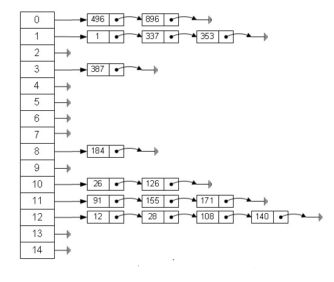

# 数据结构

人们在使用计算机解决客观世界中存在的具体问题时，
通常过程如下：
首先通过对客观世界的认知形成印象和概念从而得到了信息，
在此基础上建立概念模型，它必须能够如实地反映客观世界中的事物以及事物间的联系；
根据概念模型将实际问题转化为计算机能够理解的形式，然后设计程序；
用户通过人机交互界面与系统交流，使系统执行相应操作，最后解决实际的问题。 
数据结构主要与在上述过程中从建立概念模型到实现模型转化并为后续程序设计提供基础的内容相关。
它是用来反映一个概念模型的内部构成，即一个概念模型由那些成分数据构成，
以什么方式构成，呈现什么结构。
数据结构主要是研究程序设计问题中计算机的操作对象以及它们之间的关系和操作的学科。

## 基本概念

* **数据（data**是描述客观事物的数值、字符以及能输入机器且能被处理的各种符号集合。 
数据的含义非常广泛，除了通常的数值数据、字符、字符串是数据以外，
声音、图像等一切可以输入计算机并能被处理的都是数据。
例如除了表示人的姓名、身高、体重等的字符、数字是数据，人的照片、指纹、三维模型、语音指令等也都是数据。

* **数据元素（dataelement**是数据的基本单位，是数据集合的个体，
在计算机程序中通常作为一个整体来进行处理。例如一条描述一位学生的完整信息的数据记录就是一个数据元素；
空间中一点的三维坐标也可以是一个数据元素。数据元素通常由若干个数据项组成，
例如描述学生相关信息的姓名、性别、学号等都是数据项；
三维坐标中的每一维坐标值也是数据项。数据项具有原子性，是不可分割的最小单位。

* **数据对象（dataobject**是性质相同的数据元素的集合，是数据的子集。
例如一个学校的所有学生的集合就是数据对象，空间中所有点的集合也是数据对象。

* **数据结构（datastructure**是指相互之间存在一种或多种特定关系的数据元素的集合。
是组织并存储数据以便能够有效使用的一种专门格式，它用来反映一个数据的内部构成，
即一个数据由那些成分数据构成，以什么方式构成，呈什么结构。

由于信息可以存在于逻辑思维领域，也可以存在于计算机世界，
因此作为信息载体的数据同样存在于两个世界中。
表示一组数据元素及其相互关系的数据结构同样也有两种不同的表现形式，
一种是数据结构的逻辑层面，即数据的**逻辑结构**；一种是存在于计算机世界的物理层面，即数据的**存储结构**。

数据的逻辑结构按照数据元素之间相互关系的特性来分，
可以分为以下四种结构：集合、线性结构、树形结构和图状结构。
主要有线性表、栈、队列、树和图，其中线性表、栈、队列属于线性结构，树和图属于非线性结构。

## 抽象数据类型

抽象数据类型是描述数据结构的一种理论工具。在介绍抽象数据类型之前我们先介绍一下数据类型的基本概念。

**数据类型(datatype)** 是一组性质相同的数据元素的集合以及加在这个集合上的一组操作。
例如Java语言中就有许多不同的数据类型，
包括数值型的数据类型、字符串、布尔型等数据类型。
以Java中的int型为例，
int型的数据元素的集合是[-2147483648,2147483647]间的整数，
定义在其上的操作有加、减、乘、除四则运算，还有模运算等。

定义数据类型的作用一个是隐藏计算机硬件及其特性和差别，
使硬件对于用户而言是透明的，
即用户可以不关心数据类型是怎么实现的而可以使用它。
定义数据类型的另一个作用是，用户能够使用数据类型定义的操作，
方便的实现问题的求解。
例如，用户可以使用Java定义在int型的加法操作完成两个整数的加法运算，
而不用关心两个整数的加法在计算机中到底是如何实现的。
这样不但加快了用户解决问题的速度，也使得用户可以在更高的层面上考虑问题。

与机器语言、汇编语言相比，
高级语言的出现大大地简便了程序设计。
但是要将解答问题的步骤从非形式的自然语言表达到形式化的高级语言表达，
仍然是一个复杂的过程，仍然要做很多繁杂琐碎的事情，因而仍然需要抽象。
对于一个明确的问题，要解答这个问题，总是先选用该问题的一个数据模型。
接着，弄清该问题所选用的数据模型在已知条件下的初始状态和要求的结果状态，
以及隐含着的两个状态之间的关系。
然后探索从数据模型的已知初始状态出发到达要求的结果状态所必需的运算步骤。

我们在探索运算步骤时，首先应该考虑顶层的运算步骤，
然后再考虑底层的运算步骤。
所谓顶层的运算步骤是指定义在数据模型级上的运算步骤，或叫宏观运算。
它们组成解答问题步骤的主干部分。
其中涉及的数据是数据模型中的一个变量，暂时不关心它的数据结构；
涉及的运算以数据模型中的数据变量作为运算对象，或作为运算结果，
或二者兼而为之，简称为定义在数据模型上的运算。
由于暂时不关心变量的数据结构，
这些运算都带有抽象性质，不含运算的细节。
所谓底层的运算步骤是指顶层抽象的运算的具体实现。
它们依赖于数据模型的结构，依赖于数据模型结构的具体表示。
因此，底层的运算步骤包括两部分：一是数据模型的具体表示；
二是定义在该数据模型上的运算的具体实现。我们可以把它们理解为微观运算。
于是，底层运算是顶层运算的细化，底层运算为顶层运算服务。
为了将顶层算法与底层算法隔开，
使二者在设计时不会互相牵制、互相影响，必须对二者的接口进行一次抽象。
让底层只通过这个接口为顶层服务，顶层也只通过这个接口调用底层的运算。
这个接口就是抽象数据类型。

**抽象数据类型(abstractdatatype,简称ADT)** 由一种数据模型和在该数据模型上的一组操作组成。

抽象数据类型包括定义和实现两个方面，其中定义是独立于实现的。
抽象数据类型的定义仅取决于它的逻辑特性，而与其在计算机内部的实现无关，
即无论它的内部结构如何变化，只要它的逻辑特性不变，都不会影响到它的使用。
其内部的变化（抽象数据类型实现的变化）只是可能会对外部在使用它解决问题时的效率上产生影响，
因此我们的一个重要任务就是如何简单、高效地实现抽象数据类型。
很明显，对于不同的运算组，为使组中所有运算的效率都尽可能地高，
其相应的数据模型具体表示的选择将是不同的。
在这个意义下，数据模型的具体表示又依赖于数据模型上定义的那些运算。
特别是，当不同运算的效率互相制约时，
还必须事先将所有的运算的相应使用频度排序，
让所选择的数据模型的具体表示优先保证使用频度较高的运算有较高的效率。

我们应该看到，抽象数据类型的概念并不是全新的概念。
抽象数据类型和数据类型在实质上是一个概念，
只不过是对数据类型的进一步抽象，
不仅限于各种不同的计算机处理器中已经实现的数据类型，
还包括为解决更为复杂的问题而由用户自定义的复杂数据类型。
例如高级语言都有的“整数”类型就是一种抽象数据类型，
只不过高级语言中的整型引进实现了，并且实现的细节可能不同而已。
我们没有意识到抽象数据类型的概念已经孕育在基本数据类型的概念之中，
是因为我们已经习惯于在程序设计中使用基本数据类型和相关的运算，
没有进一步深究而已。

抽象数据类型一方面使得使用它的人可以只关心它的逻辑特征，
不需要了解它的实现方式。另一方面可以使我们更容易描述现实世界，
使得我们可以在更高的层面上来考虑问题。例如可以使用树来描述行政区划，
使用图来描述通信网络。

根据抽象数据类型的概念，
对抽象数据类型进行定义就是约定抽象数据类型的名字，
同时，约定在该类型上定义的一组运算的各个运算的名字，
明确各个运算分别要有多少个参数，这些参数的含义和顺序，
以及运算的功能。
一旦定义清楚，人们在使用时就可以像引用基本数据类型那样，
十分简便地引用抽象数据类型；
同时，抽象数据类型的实现就有了设计的依据和目标。
抽象数据类型的使用和实现都与抽象数据类型的定义打交道，
这样使用与实现没有直接的联系。
因此，只要严格按照定义，抽象数据类型的使用和实现就可以互相独立，
互不影响，实现对它们的隔离，达到抽象的目的。 
为此抽象数据类型可以使用一个三元组来表示：

    ADT=(D,S,P)
    
其中D是数据对象，S是D上的关系集，P是加在D上的一组操作。
在定义抽象数据类型时，我们使用以下格式： 

    ADT抽象数据类型名{数据对象：<数据对象的定义>数据关系：<数据关系的定义>基本操作：<基本操作的定义>}

###### ? 
数据结构的研究内容是构造复杂软件系统的基础，它的核心技术是分解与抽象。
通过分解可以划分出数据的3个层次；
再通过抽象，舍弃数据元素的具体内容，就得到逻辑结构。
类似地，通过分解将处理要求划分成各种功能，
再通过抽象舍弃实现细节，就得到运算的定义。
上述两个方面的结合可以将问题变换为数据结构。
这是一个从具体（即具体问题）到抽象（即数据结构）的过程。
然后，通过增加对实现细节的考虑进一步得到存储结构和实现运算，
从而完成设计任务。这是一个从抽象（即数据结构）到具体（即具体实现）的过程。

#### 数据的逻辑结构

指反映数据元素之间的逻辑关系的数据结构，其中的逻辑关系是指数据元素之间的前后间关系，而与他们在计算机中的存储位置无关。逻辑结构包括：
* 集合：数据结构中的元素之间除了“同属一个集合” 的相互关系外，别无其他关系
* 线性结构：数据结构中的元素存在一对一的相互关系；
* 树形结构：数据结构中的元素存在一对多的相互关系；
* 图形结构：数据结构中的元素存在多对多的相互关系。

#### 数据的物理结构

指数据的逻辑结构在计算机存储空间的存放形式。

数据的物理结构是数据结构在计算机中的表示（又称映像），
它包括数据元素的机内表示和关系的机内表示。
由于具体实现的方法有顺序、链接、索引、散列等多种，
所以，一种数据结构可表示成一种或多种存储结构。

数据元素的机内表示（映像方法）： 
用二进制位（bit）的位串表示数据元素。通常称这种位串为节点（node）。
当数据元素有若干个数据项组成时，
位串中与个数据项对应的子位串称为数据域（data field）。
因此，节点是数据元素的机内表示（或机内映像）。

关系的机内表示（映像方法）：
数据元素之间的关系的机内表示可以分为顺序映像和非顺序映像，
常用两种存储结构：顺序存储结构和链式存储结构。
顺序映像借助元素在存储器中的相对位置来表示数据元素之间的逻辑关系。
非顺序映像借助指示元素存储位置的指针（pointer）来表示数据元素之间的逻辑关系。

#### 数据存储结构

数据的逻辑结构在计算机存储空间中的存放形式称为数据的物理结构(也称为存储结构)。
一般来说，一种数据结构的逻辑结构根据需要可以表示成多种存储结构，
常用的存储结构有顺序存储、链式存储、索引存储和哈希存储等。

数据的顺序存储结构的特点是：
借助元素在存储器中的相对位置来表示数据元素之间的逻辑关系；

非顺序存储的特点是：
借助指示元素存储地址的指针表示数据元素之间的逻辑关系

#### 常用的数据结构(八大数据结构)

在计算机科学的发展过程中，数据结构也随之发展。程序设计中常用的数据结构包括如下几个。

###### 数组(Array)
数组是一种聚合数据类型，
它是将具有相同类型的若干变量有序地组织在一起的集合。
数组可以说是最基本的数据结构，在各种编程语言中都有对应。
一个数组可以分解为多个数组元素，
按照数据元素的类型，数组可以分为整型数组、字符型数组、
浮点型数组、指针数组和结构数组等。数组还可以有一维、
二维以及多维等表现形式。 

    int[] data = new int[100]；
    data[0]  = 1;

###### 栈( Stack)
栈是一种特殊的线性表，
它只能在一个表的一个固定端进行数据结点的插入和删除操作。
栈按照后进先出的原则来存储数据，也就是说，先插入的数据将被压入栈底，
最后插入的数据在栈顶，读出数据时，从栈顶开始逐个读出。
栈在汇编语言程序中，经常用于重要数据的现场保护。栈中没有数据时，
称为空栈。

###### 队列(Queue)
队列和栈类似，也是一种特殊的线性表。
和栈不同的是，队列只允许在表的一端进行插入操作，
而在另一端进行删除操作。一般来说，进行插入操作的一端称为队尾，
进行删除操作的一端称为队头。队列中没有元素时，称为空队列。

###### 链表( Linked List)
链表是一种数据元素按照链式存储结构进行存储的数据结构，
这种存储结构具有在物理上存在非连续的特点。
链表由一系列数据结点构成，每个数据结点包括数据域和指针域两部分。
其中，指针域保存了数据结构中下一个元素存放的地址。
链表结构中数据元素的逻辑顺序是通过链表中的指针链接次序来实现的。
 

 
###### 树( Tree)
树是典型的非线性结构，它是包括，2个结点的有穷集合K。
在树结构中，有且仅有一个根结点，该结点没有前驱结点。
在树结构中的其他结点都有且仅有一个前驱结点，
而且可以有两个后继结点，m≥0。 

###### 图(Graph)
图是另一种非线性数据结构。在图结构中，
数据结点一般称为顶点，而边是顶点的有序偶对。
如果两个顶点之间存在一条边，那么就表示这两个顶点具有相邻关系。

 

###### 堆(Heap)
堆是一种特殊的树形数据结构，
一般讨论的堆都是二叉堆。
堆的特点是根结点的值是所有结点中最小的或者最大的，
并且根结点的两个子树也是一个堆结构。

####### 散列表(Hash)
散列表源自于散列函数(Hash function)，
其思想是如果在结构中存在关键字和T相等的记录，
那么必定在F(T)的存储位置可以找到该记录，
这样就可以不用进行比较操作而直接取得所查记录

#### 为什么我们需要数据结构

数据是计算机科学当中最关键的实体，
而数据结构则可以将数据以某种组织形式存储，
因此，数据结构的价值不言而喻。

无论你以何种方式解决何种问题，
你都需要处理数据——无论是涉及员工薪水、股票价格、
购物清单，还是只是简单的电话簿问题。

数据需要根据不同的场景，按照特定的格式进行存储。
有很多数据结构能够满足以不同格式存储数据的需求。

###### 未来添加

图论、深度优先搜索、广度优先搜索、Prim算法、
Kruskal算法、Boruvka算法、迪杰斯特拉（Dijkstra）算法、
Bellman-Ford算法、弗洛伊德（Floyd）算法、
拓扑排序、关键路径、欧拉回路、Fleury算法
