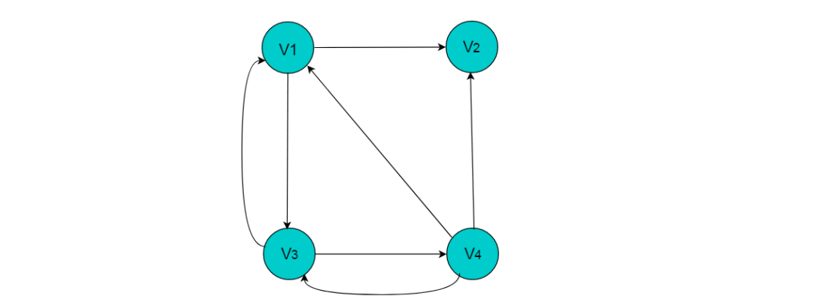

# 图存储结构

### 数组存储

**图的数组存储**方式也称为**邻接矩阵存储**。

图中的数据信息包括：顶点信息和描述顶点之间关系的边的信息，将这两种信息存储在数组中即为图的数组存储。

首先，创建顶点数组，顶点数组中存储的是图的顶点信息，采用一维数组的方式即可存储所有的顶点信息。存储图中边的信息时，由于边是描述顶点与顶点之间关系的信息，因此需要采用二维数组进行存储。

##### 定义

设图G有n个顶点，则邻接矩阵是一个n X n的方阵A，定义为：

其中，<Vi , Vj>或者(Vi , Vj,)表示顶点Vi与顶点Vj邻接。wi,j表示边的权重值。

例如：下图所示的无向图，采用数组存储形式如下。

注：图中的数组存储方式简化了边的权值为1。

###### 无向图的数组存储主要有以下特性

    （1）顶点数组长度为图的顶点数目n。边数组为n X n的二维数组。
    （2）边数组中，A[i][j] =1代表顶点i与顶点j邻接，A[i][j] = 0代表顶点i与顶点j不邻接。
    （3）在无向图中。由于边是无向边，因此顶点的邻接关系是对称的，边数组为对称二维数组。
    （4）顶点与自身之间并未邻接关系，因此边数组的对角线上的元素均为0。
    （5）顶点的度即为顶点所在的行或者列1的数目。例如：顶点V2的度为3，则V2所在行和列中的1的数目为3。

当图为有向图时，图的数组存储方式要发生变化。

例如：下图所示的有向图，采用数组存储形式如下。

###### 有向图的数组存储主要有以下特性

    （1）顶点数组长度为图的顶点数目n。边数组为n X n的二维数组。
    （2）边数组中，数组元素为1，即A[i][j] = 1,代表第i个顶点与第j个顶点邻接，且i为尾，j为头。 A[i][j] = 0代表顶点与顶点不邻接。
    （3）在有向图中，由于边存在方向性，因此数组不一定为对称数组。
    （4）对角线上元素为0。
    （5）第i行中，1的数目代表第i个顶点的出度。例如：顶点V1的出度为2，则顶点V1所在行的1的数目为2。
    （6）第j列中，1的数目代表第j个顶点的入度。例如：V3的入度为1，则V3所在列中1的数目为1。

##### 数组存储方式优点

数组存储方式容易实现图的操作。例如：求某顶点的度、判断顶点之间是否有边（弧）、找顶点的邻接点等等。

##### 数组存储方式缺点

采用数组存储方式，图若有n个顶点则需要n2个单元存储边(弧)，空间存储效率为O(n2)。 
当顶点数目较多，边数目较少时，此时图为稀疏图，这时尤其浪费空间。

例如：下图中有9个顶点，边数为10，需要9X9的二维数组，
而实际存储边信息空间只有10，造成空间浪费。

上图所示无向图的存储数组：

### 邻接表

当使用数组存储时，主要有以下三个问题：

    （1）对于一个图，若图中的顶点数目过大，则无法使用邻接矩阵进行存储。因为在分配数组内存时可能会导致内存分配失败。
    （2）对于某些稀疏图（即顶点数目多，边数目少），创建的数组大小很大，而真正存储的有用信息又很少，这就造成了空间上的浪费。
    （3）有时两个点之间不止存在有一条边，这是用邻接矩阵就无法同时表示两条以上的边。

针对以上情况，提出了一种特殊的图存储方式，让每个节点拥有的数组大小刚好就等于它所连接的边数，
由此建立一种邻接表的存储方式。

**邻接表存储**方法是一种数组存储和链式存储相结合的存储方法。
在邻接表中，对图中的每个顶点建立一个单链表，第i个单链表中的结点依附于顶点Vi的边（对有向图是以顶点Vi为尾的弧）。
链表中的节点称为表节点，共有3个域，具体结构见下图：

**表结点**由三个域组成，adjvex存储与Vi邻接的点在图中的位置，nextarc存储下一条边或弧的结点，data存储与边或弧相关的信息如权值。

除表节点外，需要在数组中存储**头节点**，**头结点**由两个域组成，分别指向链表中第一个顶点和存储Vi的名或其他信息。具体结构如下图：

其中，data域中存储顶点相关信息，firstarc指向链表的第一个节点。

##### 无向图采用邻接表方式存储

例如：下图所示的无向图采用邻接表存储。

采用邻接表方式存储上图中的无向图，绘图过程中忽略边节点的info信息，头结点中的data域存储顶点名称。
以V1顶点为例，V1顶点的邻接顶点为V2、V3、V4，则可以创建3个表节点，表节点中adjvex分别存储V2、V3、V4的索引1、2、3，按照此方式，得到的邻接表为：

##### 无向图的邻接表存储特性：

    （1）数组中头节点的数目为图的顶点数目。
    （2）链表的长度即为顶点的度。例如：V1顶点的度为3，则以V1为头节点的链表中表节点的数目为3。
    
##### 有向图采用邻接表方式存储

例如：图 6.3 所示的有向图采用邻接表存储。

采用邻接表方式存储图6.3中的有向图，绘图过程中忽略边节点的info信息，
头结点中的data域存储顶点名称。以V1顶点为例，
V1顶点的邻接顶点为V2、V3、V4，但是以V1顶点为尾的边只有两条，
即和因此，创建2个表节点。表节点中adjvex分别存储V3、V4的索引2、3，
按照此方式，得到的邻接表为：

##### 有向图的邻接表存储特性：

    （1）数组中表节点的数目为图的顶点数目。
    （2）链表的长度即为顶点的出度。例如V1的出度为2，V1为头节点的链表中，表节点的数目为2。
    （3）顶点Vi的入度为邻接表中所有adjvex值域为i的表结点数目。例如：顶点V3的入度为4，则链表中所有adjvex值域为2的表结点数目为4。
    
注：图采用邻接表的方式表示时，其表示方式是不唯一的。这是因为在每个顶点对应的单链表中，各边节点的链接次序可以是任意的，取决于建立邻接表的算法以及边的输入次序。

### 逆邻接表

在邻接表中，可以轻易的得出顶点的出度，但是想要得到顶点的入度，则需要遍历整个链表。为了便于确定顶点的入度，可以建立有向图的逆邻接表。逆邻接表的建立与邻接表相反。

采用逆邻接表的方式存储图3.2所示的无向图。以V3顶点为例，V3顶点的邻接顶点为V1、V2、V4、V5，以V3顶点为头的边有4条，即、、、因此，创建4个表节点。表节点中adjvex分别存储V0、V1、V3、V4的索引0、1、3、4，按照此方式，得到的逆邻接表为：

### 十字链表

对于有向图而言，邻接链表的缺陷是要查询某个顶点的入度时需要遍历整个链表，而逆邻接链表在查询某个顶点的出度时要遍历整个链表。为了解决这些问题，十字链表将邻接链表和逆邻接链表综合了起来，而得到的一种十字链表。在十字链表中，每一条边对应一种边节点，每一个顶点对应为顶点节点。

顶点节点
顶点节点即为头节点，由3个域构成，具体形式如下：

其中，data域存储与顶点相关的信息，firstin和firstout分别指向以此顶点为头或尾的第一个边节点。
边节点
在边节点为链表节点，共有 5 个域，具体形式如下：

其中，尾域tailvex和头域headvex分别指向尾和头的顶点在图中的位置。链域hlink指向头相同的下一条边，链域tlink指向尾相同的下一条边。info 存储此条边的相关信息。
例如：图8.1所示的有向图，采用十字链表存储图方式。

采用十字链表的方式存储图8.1中的有向图，绘图过程忽略边节点中的info信息，表头节点中的data域存储顶点名称。
以V1顶点为例，顶点节点的data域存储V1顶点名，firstin存储以V1顶点为头第一个边节点，以V1顶点为头边为，firstout存储以以V1顶点为尾第一个边节点，对应边为。
按照此规则，得到的十字链表存储为：

注：采用十字链表存储时，表头节点仍然使用数组存储，采用下标索引方式获取。

### 邻接多重表

对于无向图而言，其每条边在邻接链表中都需要两个结点来表示，而邻接多重表正是对其进行优化，让同一条边只用一个结点表示即可。邻接多重表仿照了十字链表的思想，对邻接链表的边表结点进行了改进。

重新定义的边结点结构如下图：

其中，ivex和jvex是指某条边依附的两个顶点在顶点表中的下标。 ilink指向依附顶点ivex的下一条边，jlink指向依附顶点jvex的下一条边。info存储边的相关信息。

重新定义的顶点结构如下图：

其中，data存储顶点的相关信息，firstedge指向第一条依附于该顶点的边。

例如：图9.1所示的无向图，采用邻接多重表存储图。

图 9.1 所示的无向图，采用邻接多重表存储，以 V0 为例，顶点节点的data域存储V0名称，firstedge 指向(V0 , V1)边，边节点中的ilink指向依附V0顶点的下一条边(V0 , V3)，jlink指向依附V1顶点的下一条边(V1 , V2)，按照此方式建立邻接多重表：

