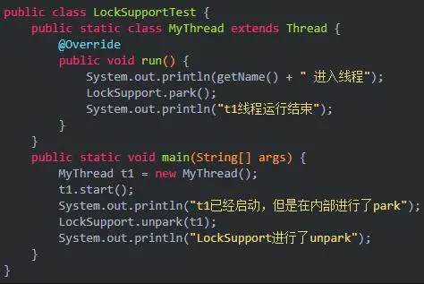
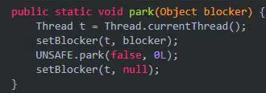
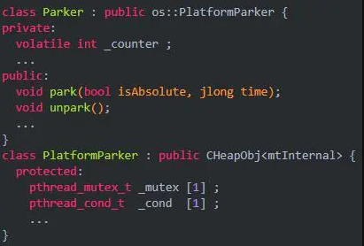
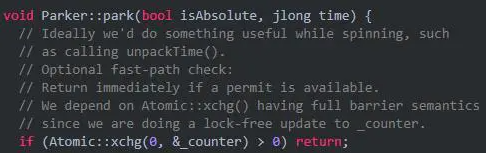
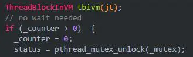
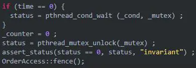
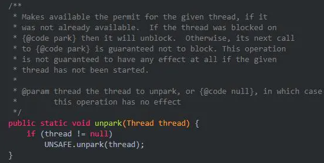
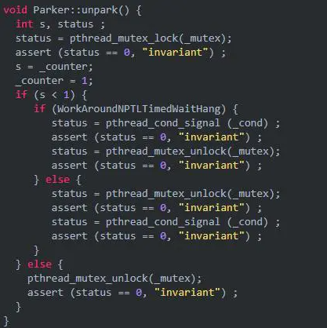

# 深入理解LockSupport

### LockSupport简介

##### LockSupport是什么

刚刚开头提到过，LockSupport是一个线程工具类，所有的方法都是静态方法，可以让线程在任意位置阻塞，也可以在任意位置唤醒。

它的内部其实两类主要的方法：park（停车阻塞线程）和unpark（启动唤醒线程）。

注意上面的123方法，都有一个blocker，这个blocker是用来记录线程被阻塞时被谁阻塞的。
用于线程监控和分析工具来定位原因的。

现在我们知道了LockSupport是用来阻塞和唤醒线程的，
而且之前相信我们都知道wait/notify也是用来阻塞和唤醒线程的，那么它相比，LockSupport有什么优点呢？

##### 与wait/notify对比

这里假设你已经了解了wait/notify的机制，如果不了解，请移步[深入理解wait和notify](wait-notify.md)。
相信你既然学到了这个LockSupport，相信你已经提前已经学了wait/notify。

我们先来举一个使用案例：

上面这段代码的意思是，我们定义一个线程，但是在内部进行了park，因此需要unpark才能唤醒继续执行，不过上面，我们在MyThread进行的park，在main线程进行的unpark。

这样来看，好像和wait/notify没有什么区别。那他的区别到底是什么呢？这个就需要仔细的观察了。这里主要有两点：

1. wait和notify都是Object中的方法,在调用这两个方法前必须先获得锁对象，但是park不需要获取某个对象的锁就可以锁住线程。
2. notify只能随机选择一个线程唤醒，无法唤醒指定的线程，unpark却可以唤醒一个指定的线程。

区别就是这俩，还是主要从park和unpark的角度来解释的。
既然这个LockSupport这么强，我们就深入一下他的源码看看。

### 源码分析（基于jdk1.8）

##### park方法

blocker是用来记录线程被阻塞时被谁阻塞的。用于线程监控和分析工具来定位原因的。setBlocker(t, blocker)方法的作用是记录t线程是被broker阻塞的。因此我们只关注最核心的方法，也就是UNSAFE.park(false, 0L)。

UNSAFE是一个非常强大的类，他的的操作是基于底层的，也就是可以直接操作内存，因此我们从JVM的角度来分析一下：

每个java线程都有一个Parker实例：

我们换一种角度来理解一下park和unpark，可以想一下，unpark其实就相当于一个许可，告诉特定线程你可以停车，特定线程想要park停车的时候一看到有许可，就可以立马停车继续运行了。因此其执行顺序可以颠倒。

现在有了这个概念，我们体会一下上面JVM层面park的方法，这里面counter字段，就是用来记录所谓的“许可”的。

当调用park时，先尝试直接能否直接拿到“许可”，即_counter>0时，如果成功，则把_counter设置为0,并返回。

如果不成功，则构造一个ThreadBlockInVM，然后检查_counter是不是>0，如果是，则把_counter设置为0，unlock mutex并返回:

否则，再判断等待的时间，然后再调用pthread_cond_wait函数等待，如果等待返回，则把_counter设置为0，unlock mutex并返回：

这就是整个park的过程，总结来说就是消耗“许可”的过程。

##### unpark

还是先来看一下JDK源码：

上面注释的意思是给线程生产许可证。

当unpark时，则简单多了，直接设置_counter为1，再unlock mutext返回。
如果_counter之前的值是0，则还要调用pthread_cond_signal唤醒在park中等待的线程：

ok，现在我们已经对源码进行了分析，整个过程其实就是生产许可和消费许可的过程。
而且这个生产过程可以反过来。也就是先生产再消费。下面我们使用几个例子验证一波。

### LockSupport使用

先interrupt再park
